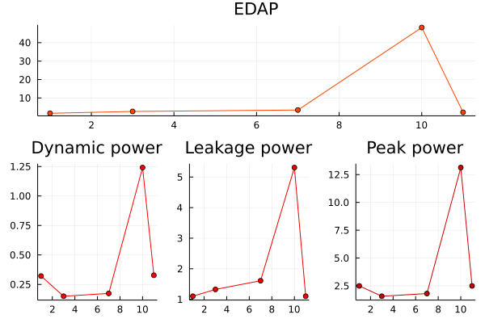
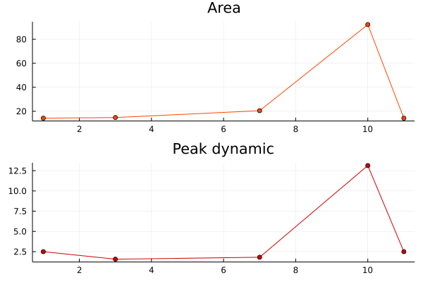
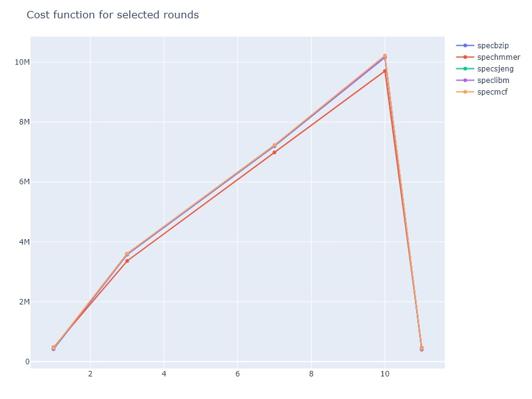

# Computer-Arch-Lab-3

This is a report regarding the findings of the third Part of the Computer Architecture Course Lab of Aristotle University in Thessaloniki.

## Part 1: Getting familiar with McPAT

During this part we had the opportunity to familiarize ourselves with *mcPat*, a simulator which can provide analytic feedback concerning the __power consumption__ , __harware area space__ and __system timing__, of a given archtecture model. Let's take a dive into this useful tool:

1. *McPAT's* original ***validation report*** was published in *December 12th, 2009*. The validation process aimed to testify for the accuracy and fidelity of the tool's results by comparing a series of processors' published data regarding power and area, provided the timing of each individual system, to the respective data extracted from McPAT. The processor models used in this process were:

* 90nm ***Niagara*** processor running at __1.2GHz__ with a __1.2V__ power supply
* 65nm ***Niagara2*** processor running at __1.4GHz__ with a __1.1V__ power supply
* 65nm ***Xeon*** processor running at __3.4GHz__ with a __1.25V__ power supply
* 180nm ***Alpha 21364*** processor running at __1.2GHz__ with a __1.5V__ power supply

  This comparison's results were definitely in McPAT's favor, as all extracted data had minimal differences from the original data.


| __Processor__       | *Published total Power* | *Published total Area* | *McPAT total Power* | *McPAT total Area* | *% McPAT Error* |
| ------------------- | ----------------------- | ---------------------- | ------------------- | ------------------ | --------------- |
| ***Niagara***       | 63 W                    | 378 mm<sup>2</sup>     | 56.17 W             | 295 mm<sup>2</sup> | -10.84 / -21.8  |
| ***Niagara2***      | 84 W                    | 342 mm<sup>2</sup>     | 69.70 W             | 248 mm<sup>2</sup> | -17.02 / -27.3  |
| ***Xeon Tulsa***    | 150 W                   | 435 mm<sup>2</sup>     | 116.08 W            | 362 mm<sup>2</sup> | -22.61 / -16.7  |
| ***Alpha 21364***   | 125 W                   | 396 mm<sup>2</sup>     | 97.90 W             | 324 mm<sup>2</sup> | -21.68 / -18.2  |

The conclusion we can come to, based on this table, is that McPAT computed all the data with values ranging about 20% lower than the actual published ones.
The fact that the error in each case is practically the same can help us identify this error without knowing the actual published data of the processor unit, for example, in an experimental architecture undergoing tests before materialization.

2. McPAT calculates the power dissipation of a processor model. Being aware of the power cost is one of the most critical advantages when designing a specific architecture model, because it can allow the architect to make desicions having an estimation of how the system distributes its supply power and how much unwanted power is being used. We can divide power dissipation in three main parts:


* ***Dynamic Power***: Circuits dissipate *dynamic power* when they charge and discharge the capacitive loads to switch states. Dynamic power is proportional to the total load capacitance, the supply voltage, the voltage swing during switching, the clock frequency, and the activity factor.

* ***Short-Circuit Power***: Switching circuits also dissipate short-circuit power due to a momentary short through the pull-up and pull-down devices.

* ***Leakage/Static Power***: Transistors in circuits leak, dissipating static power. Leakage current depends on the width of the transistors and the local state of the devices. There are two leakage mechanisms. Subthreshold leakage occurs because a small current passes between the source and drain of off-state transistors. Gate leakage is the current leaking through the gate terminal, and varies greatly with the state of the device.

According to our research, leakage power shows great variability, heavily depending on the nature of the program. Using [the documentation](https://www.hpl.hp.com/research/mcpat/McPATAlpha_TechRep.pdf), leakage power is dependent on the state in which the transistors are in, which is subsequently dependent on the way the hardware uses them, leading us back to the conclusion that the program being executed is responsible for the static power dissipation. Since power is time-independent, the time a program takes to be executed isn't likely to affect how power is dissipated.

3. Now, suppose we have the exact same set of hardware twice, including the battery, but each time, **the processor model is different**: the first uses _25W_ and the second uses _35W_ of power. Before we make any conclusions about which processors actually results to better battery life, we first have to form a brief explanation on the concept of **energy efficiency**.
\
\
As per [Energy Star](https://www.energystar.gov/about/about_energy_efficiency), _energy efficiency means using less energy to get the same job done_. This essentially means that an energy efficient solution could be more power intense in theory, but execute the required task much quicker, this way conserving energy.
\
\
Therefore, we aren't able to determine the energy a system has consumed only by looking at the **power statistics**. We also need to know the **time** a program or an operation took to be executed. This is one of the reasons that McPAT alone doesn't provide us with the necessary information, if we're looking to make a decision about which processor is the most useful and energy efficient for our use case. We could, however, say that McPAT linked with experiment results by **gem5** is sufficient to draw such assumptions.
\
**Static power consumption** also plays a critical role in a system's battery longevity, since it is known energy is also wasted in the _idle state_. This problem can be solved with ***power gating***, a method in which unused parts of the circuit receive no power at all. This way we don't have to trust that the transistors' "off state" is actually off. 

4. For this part, we assume that a _Xeon_ is **40 times faster** than an _ARM A9_ processor and we try to make an estimation about which model is the most energy efficient. We extract the necessary information by running McPAT tests under `print_level` equal to **5**:

_**Xeon**_
```
  Total Leakage = 36.8319 W
  Runtime Dynamic = 72.9199 W
```
_**ARM A9**_
```
  Total Leakage = 0.108687 W
  Runtime Dynamic = 2.96053 W
```

Right away, we can see the vast difference in power consumption. After just a little investigation, it is clear to see that, if we had a way to completely shut the system down after the completion of a task, the Xeon model would be more energy efficient. However, the massive discrepancy in energy consumption is still present, and even larger, when it comes to static power. This means that, even if the total needed energy for a task is comparable for both of the models, the energy that is wasted while the system waits for another operation to be assigned outweighs the former benefits.

## Part 2: Combining McPAT and GEM5

The combination of these two powerful tools can provide us with useful information that can help us extract the ***EDAP*** value for differents architeural model. It is the best way for us to have a knowledge on the impact the architectural choices we make affect all aspects of the system's efficiency. 

1. We can access data about the ***Area*** quite easily, as *mcPAT*'s output files contain straightforward information concerning the area that is needed for the model's realisation. On the other hand, the *stats.txt* file provides with the exact *runtime* of each round which is a very accurate metric for comparing ***Delay***. Last but not least, the ***Energy*** data can be extracted by running the ***print_energy.py*** script with *mcPAT*'s output file and *gem5*'s stats.txt file as input. Unfortunately this particular script did not run. So we searched inside the .py file to determine how the energy is computed. The function that does exactly that is called getEnergy:

```python
# @file: print_energy.py
def getEnergy(mcpatoutputFile, statsFile):
    leakage, dynamic = readMcPAT(mcpatoutputFile)
    runtime = getTimefromStats(statsFile)
    energy = (leakage + dynamic)*runtime
    print "leakage: %f W, dynamic: %f W and runtime: %f sec" % (leakage, dynamic, runtime)
    return energy*1000
```

As we can see, the function adds Dynamic Power and Leakage Power and multiplies the with the total runtime. This is the exact value of the energy that the system consumed while running each of the benchmarks.So, this is how we are going to compute it as well.

energy = (leakage + dynamic)*runtime

In conclusion, we can use the *EDAP*(Energy * Delay * Area) product to evaluate the efficiency of each model we used, taking everything that matters into consideration. Being energy efficient in addition to great performance is what we are striving for.

2. After collecting all the necessary data we are able to compare 5 rounds of 5 *SPEC CPU2006* benchmarks, with a different processor model in each round. We can now visualize how much the different changes we make to the system affect the overall efficiency of it. We used 5 rounds of *gem5* simulations in which we saw the most significant changes in the cost function we composed. The changes that were done in each round were:

|            | icache.size | dcache.size | l2cache.size | icache.assoc | dcache.assoc | l2cache.assoc | block_size |
| ---------- | ----------- | ----------- | ------------ | ------------ | ------------ | ------------- | ---------- |
|1: round 1  | 32KB        | 64KB        | 2MB          | 2            | 2            | 8             | 64bytes    |
|2: round 3  | 256KB       | 64KB        | 1MB          | 2            | 1            | 2             | 32bytes    |
|3: round 7  | 512KB       | 128KB       | 1MB          | 2            | 2            | 2             | 32bytes    |
|4: round 10 | 512KB       | 256KB       | 2MB          | 4            | 2            | 4             | 128bytes   |
|5: round 11 | 32KB        | 64KB        | 2MB          | 2            | 2            | 8             | 64bytes    | 

In the graphs we generated using the combined data we can see the fluctuation of the *EDAP* throught the different rounds. In round 10 (4), there is the most sensible increase of the *EDAP*, as well as **power consumption** alone. This considerable difference can be justified by the significantly bigger cache sizes and block size. WE can clearly see in the graphs below that bigger cache sizes result in increase in both area and power, as these two fluctuate accordingly. However, we can't say the same about the associativity because by observing the graphs we can agree that both rounds 1 and 11, in which we used caches with higher associativity have the lowest *EDAP* values. It doesn't seem to affect the **Area** aspect either, which is affected almost exclusively by cache size.





**Please note, all the graphs we produced can be found in [the output folder](./output)**

3. We made a cost function in order to compare the results provided by *gem5* from the different processor models we used. This function was made arbitrarily and contained two factors that play a big role in performance and cost.

Cost = ( 5 * l1cache.size + l2cache.size ) * sqrt( assoc )



If we take a look at the *EDAP* and *cost function* graphs we can observe a very similar behaviour between the different rounds. The conclusion we come to is that performance always comes with a "cost". Always, the faster solusions result in either bigger sizes, increased power consumption or both and ultimately come with a bigger price tag of course. Our goal in the architecture field is to find a golden mean, in which we don't have to sacrifice everything for the sake of performance. That of course relies heavily on the purpose of every machine, so we have to take everything into consideration to make the best decisions possible.

Antonios Atnoniou - 9482
Dimitrios Xylogiannis - 9672