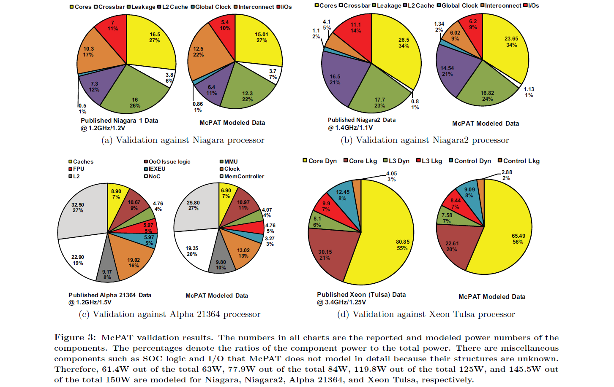
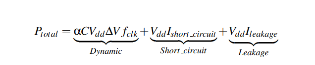

# Computer-Arch-Lab-3

This is a report regarding the findings of the third Part of the Computer Architecture Course Lab of Aristotle University in Thessaloniki.

## Part 1: Getting familiar with McPAT

During this part we had the opportunity to familiarize ourselves with *mcPat*, a simulator which can provide analytic feedback concerning the __power consumption__ , __harware area space__ and __system timing__, of a given archtecture model. Let's take a dive into this useful tool:

1. *McPAT's* original ***validation report*** was published in *December 12th, 2009*. The validation process aimed to testify for the accuracy and fidelity of the tool's results by comparing a series of processors' published data regarding power and area, provided the timing of each individual system, to the respective data extracted from McPAT. The processor models used in this process were:

* 90nm ***Niagara*** processor running at __1.2GHz__ with a __1.2V__ power supply
* 65nm ***Niagara2*** processor running at __1.4GHz__ with a __1.1V__ power supply
* 65nm ***Xeon*** processor running at __3.4GHz__ with a __1.25V__ power supply
* 180nm ***Alpha 21364*** processor running at __1.2GHz__ with a __1.5V__ power supply

  This comparison's results were definitely in McPAT's favor, as all extracted data had minimal differences from the original data.

| __Processor__       | *Published total Power* | *Published total Area* | *McPAT total Power* | *McPAT total Area* | *% McPAT Error* |
| ------------------- | ----------------------- | ---------------------- | ------------------- | ------------------ | --------------- |
| ***Niagara***       | 63 W                    | 378 mm2                | 56.17 W             | 295 mm2            | -10.84 / -21.8  |
| ***Niagara2***      | 84 W                    | 342 mm2                | 69.70 W             | 248 mm2   x         | -17.02 / -27.3  |
| ***Xeon Tulsa***    | 150 W                   | 435 mm2                | 116.08 W            | 362 mm2            | -22.61 / -16.7  |
| ***Alpha 21364***   | 125 W                   | 396 mm2                | 97.90 W             | 324 mm2            | -21.68 / -18.2  |

The conclusion we can come to, based on this table, is that McPAT computed all the data with values ranging about 20% lower than the actual published ones.
The fact that the error in each case is practically the same can help us identify this error without knowing the actual published data of the processor unit, for example, in an experimental architecture undergoing tests before materialization.

2. McPAT calculates the power dissipation of a processor model. Being aware of the power cost is one of the most critical advantages when designing a specific architecture model, because it can allow the architect to make desicions having an estimation of how the system distributes its supply power and how much unwanted power is being used. We can divide power dissipation in three main parts:

* ***Dynamic Power***: Circuits dissipate *dynamic power* when they charge and discharge the capacitive loads to switch states. Dynamic power is proportional to the total load capacitance, the supply voltage, the voltage swing during switching, the clock frequency, and the activity factor.

* ***Short-Circuit Power***: Switching circuits also dissipate short-circuit power due to a momentary short through the pull-up and pull-down devices.

* ***Leakage/Static Power***: Transistors in circuits leak, dissipating static power. Leakage current depends on the width of the transistors and the local state of the devices. There are two leakage mechanisms. Subthreshold leakage occurs because a small current passes between the source and drain of off-state transistors. Gate leakage is the current leaking through the gate terminal, and varies greatly with the state of the device.

According to our research, leakage power shows great variability, heavily depending on the nature of the program. Using [the documentation](https://www.hpl.hp.com/research/mcpat/McPATAlpha_TechRep.pdf), leakage power is dependent on the state in which the transistors are in, which is subsequently dependent on the way the hardware uses them, leading us back to the conclusion that the program being executed is responsible about the static power dissipation. Since power is time-independent, the time a program takes to be executed isn't likely to affect power dissipation.

3. 